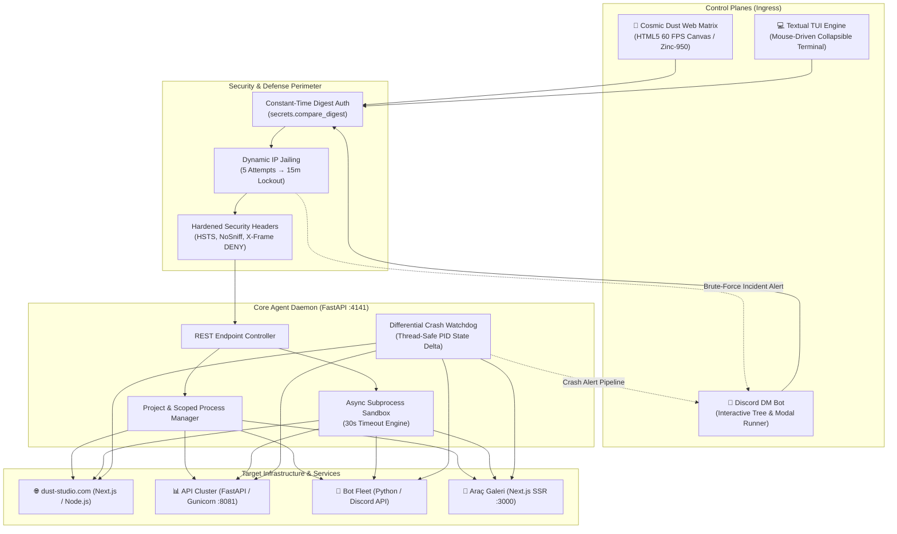
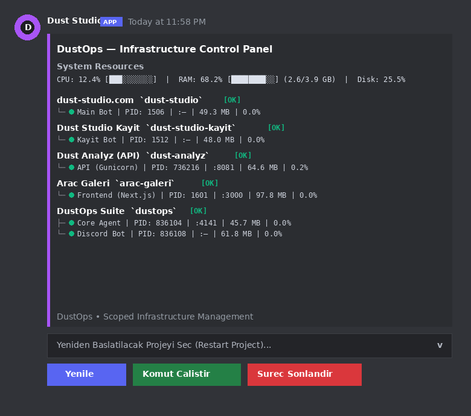
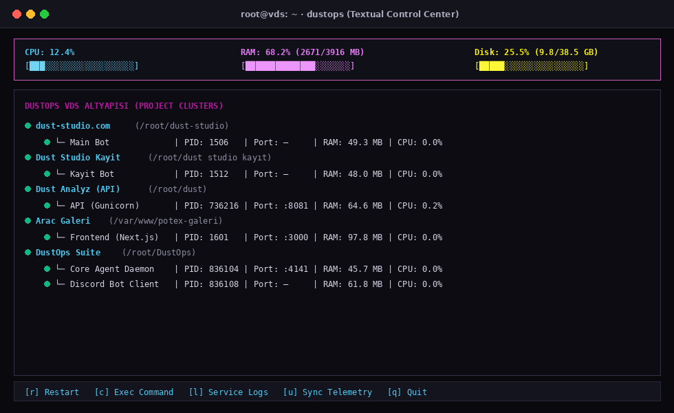

<div align="center">

# 🛡️ DustOps

### Enterprise-Grade Infrastructure Orchestrator, Scoped Process Lifecycle Manager & Unified Telemetry Matrix

[](https://python.org)
[](https://fastapi.tiangolo.com)
[](https://discordpy.readthedocs.io/)
[](https://textual.textualize.io/)
[](#system-architecture)
[](#security--defense-in-depth)
[](LICENSE)

<br/>

> **"Eliminating process blindness, brittle shell scripts, and manual SSH intervention across mission-critical cloud nodes."**

</div>

---

## Executive Summary

**DustOps** is an asynchronous, event-driven infrastructure control and process orchestration suite designed for production Virtual Dedicated Servers (VDS) and microservice clusters. 

Modern production deployments frequently suffer from unmonitored background workers, generic process collisions (such as identical `node` or `python3` binary signatures), and fragmented monitoring. DustOps solves these architectural challenges by providing **deterministic project-scoped process mapping**, **sandboxed non-blocking command execution**, and **triple-interface unified management** (Web Matrix, Discord DM Operations, and Mouse-Driven Terminal TUI).

---

## 🏛️ System Architecture



---

## ⚡ Key Architectural Capabilities

### 1. Project-Based Deterministic Process Mapping (`projects.json`)
Rather than blindly matching generic binary names (`node`, `python3`), the Core Agent maps running processes deterministically by evaluating:
- **Process Working Directory (`proc.cwd()`):** Matches exact project root hierarchies.
- **Full Execution Command Line (`proc.cmdline()`):** Matches script entrypoints and arguments.
- **Port Bindings (`proc.net_connections()`):** Matches active listening TCP sockets.

This guarantees zero cross-service collision between independent projects residing on the same host.

### 2. Sandboxed Asynchronous Command Execution
- **Non-Blocking Architecture:** Executed via `asyncio.create_subprocess_shell`. Long-running tasks (e.g. `git pull && npm run build`) never block the FastAPI event loop, ensuring continuous heartbeat tracking and telemetry streaming.
- **Strict 30-Second Timeout Shield:** Commands exceeding 30 seconds are automatically terminated via `SIGKILL` to prevent resource hogging.
- **Directory Scoping:** Commands execute strictly inside the configured project root (`cwd`).
- **Buffer Slicing:** Terminal outputs exceeding messaging limits are safely sliced (e.g., last 1800 characters) in formatted monospace blocks.

### 3. Resilient Self-Restart Orchestration
When orchestrating a restart of DustOps itself (`dustops-agent`), traditional tools crash mid-request, causing broken TCP connections. DustOps employs a **scheduled delayed restart pipeline**:
1. Validates request and dispatches an immediate `200 OK` JSON response.
2. Schedules a detached background task (`asyncio.create_task`).
3. Waits for HTTP transport completion (1.0s delay), then cleanly triggers process reinvocation.

### 4. Enterprise Security & Anti-Bruteforce Perimeter
- **Timing-Attack Immune:** Authentication relies on cryptographic constant-time comparison (`secrets.compare_digest`), preventing side-channel statistical analysis.
- **Dynamic IP Jailing:** An in-memory failure counter locks out any IP exceeding 5 failed authentication attempts for 900 seconds (15 minutes), responding with `HTTP 429 Too Many Requests`.
- **Instant Incident Telemetry:** When an IP is jailed, an immediate high-priority alert is dispatched to the administrator's Discord DM containing the exact attacker IP address and timestamp.
- **Security Headers:** Enforces `Strict-Transport-Security`, `X-Frame-Options: DENY`, `X-Content-Type-Options: nosniff`, and `X-XSS-Protection`.

---

## 🖥️ Triple-Interface Unified Control Matrix

### 🌌 1. Cosmic Dust Web Matrix
- **Visual Design:** High-performance, zero-dependency HTML5 Canvas particle engine rendering 1,400+ cosmic dust particles with interactive mouse-vortex and spring physics.
- **Aesthetic:** Minimalist Zinc-950 (`#09090b`) dark luxury palette, translucent glassmorphism cards (`backdrop-filter: blur(20px)`), and Google `Inter` + `JetBrains Mono` typography.
- **Functionality:** Real-time CPU, RAM, and Disk utilization gauges, live project cluster cards, and a Raycast-style command execution modal.

### 🤖 2. Discord DM Incident & Control Center
- **Owner-Only Security:** All button callbacks, modals, and selects enforce `interaction.user.id == OWNER_USER_ID`.
- **Grouped Hierarchical Embeds:** Displays clean ASCII tree structures showing service states, PIDs, ports, CPU, and RAM metrics.
- **Interactive Modals & Menus:** Dropdown project restart selector, interactive process termination modal, and directory-scoped command execution dialogs.

<div align="center">
  
  <p><em>Real-Time Project Scoped Management & Interactive Action Components inside Discord Direct Messages</em></p>
</div>

### 💻 3. Modern Terminal TUI (`Textual` Engine)
- **Invocation:** Accessible directly from any terminal via the `dustops` binary.
- **Features:** Mouse-supported collapsible tree view, live resource progress bars, and high-productivity keybindings:
  - <kbd>r</kbd> — Instant project / service restart
  - <kbd>c</kbd> — Interactive shell command popup
  - <kbd>l</kbd> — Process inspection & telemetry log viewer
  - <kbd>u</kbd> — Manual data synchronization
  - <kbd>q</kbd> — Clean exit

<div align="center">
  
  <p><em>Mouse-Supported Collapsible Project Tree & Live Telemetry Gauges inside the Linux Terminal</em></p>
</div>

---

## 📋 Configuration Reference

### `.env` Specification

| Variable | Type | Default | Description |
| :--- | :---: | :---: | :--- |
| `DISCORD_TOKEN` | `string` | — | Discord Bot token from Developer Portal |
| `OWNER_USER_ID` | `int` | — | Discord user ID authorized for DM control |
| `API_HOST` | `string` | `0.0.0.0` | Bind IP for Core Agent REST API |
| `API_PORT` | `int` | `4141` | Bind port for Core Agent REST API |
| `WEB_USERNAME` | `string` | `admin` | Authentication username for Web and API |
| `WEB_PASSWORD` | `string` | — | Authentication password for Web and API |
| `WATCH_KEYWORDS` | `list` | `node,python` | Fallback process keywords for watchdog |
| `WATCH_PORTS` | `list` | `3000,8080` | Port bindings to continuously track |
| `WATCHDOG_INTERVAL` | `int` | `5` | Background differential check interval (sec) |
| `DASHBOARD_INTERVAL` | `int` | `3600` | Automated Discord DM embed update interval |

### `projects.json` Schema

```json
{
  "projects": [
    {
      "id": "dust-studio",
      "name": "🌐 dust-studio.com",
      "cwd": "/root/dust-studio",
      "services": [
        {
          "name": "Main Bot",
          "match": "dust-studio",
          "port": null,
          "restart_cmd": "pm2 restart dust-studio"
        }
      ]
    },
    {
      "id": "backend-api",
      "name": "📊 Core API Cluster",
      "cwd": "/root/dust",
      "services": [
        {
          "name": "FastAPI / Gunicorn",
          "match": "gunicorn",
          "port": 8081,
          "restart_cmd": "systemctl restart dust-analyz"
        }
      ]
    }
  ]
}
```

---

## 📡 REST API Specification

All endpoints (excluding `/health`) require HTTP Basic Authentication using `WEB_USERNAME` and `WEB_PASSWORD`.

| Method | Endpoint | Description | Response |
| :---: | :--- | :--- | :---: |
| `GET` | `/` | Serves the Cosmic Dust Web Matrix | `HTML` |
| `GET` | `/health` | Unauthenticated agent liveness probe | `{"status": "ok"}` |
| `GET` | `/metrics` | CPU, RAM, and Disk storage snapshot | `SystemMetrics` |
| `GET` | `/projects` | Live project clusters with nested process info | `list[ProjectStatus]` |
| `GET` | `/projects/{id}` | Telemetry for a single project cluster | `ProjectStatus` |
| `POST` | `/projects/{id}/restart` | Triggers configured project restart pipeline | `ActionResult` |
| `POST` | `/projects/{id}/exec` | Executes sandboxed shell command inside project `cwd` | `ExecResult` |
| `POST` | `/kill/{pid}` | Sends `SIGTERM` / `SIGKILL` to target process | `ActionResult` |
| `GET` | `/crashes` | Drains pending crash events from memory buffer | `list[CrashEvent]` |

---

## 🚀 Quick Start Guide

### 1. Clone & Setup Environment
```bash
git clone https://github.com/Dust-exe/DustOps.git
cd DustOps

# Create virtual environment (recommended)
python3 -m venv .venv
source .venv/bin/activate

# Install production dependencies
pip install -r requirements.txt
```

### 2. Configure Credentials & Projects
```bash
cp .env.example .env
nano .env

cp projects.example.json projects.json
nano projects.json
```

### 3. Production Deployment (via PM2)
```bash
# Start Core Agent Daemon
pm2 start run_agent.py --name dustops-agent --interpreter python3

# Start Discord Bot Controller
pm2 start run_bot.py --name dustops-bot --interpreter python3

# Save PM2 state for automatic reboot recovery
pm2 save
```

### 4. Access Control Matrix
- **Web Interface:** Navigate to `http://<SERVER_IP>:4141` in any browser.
- **Terminal TUI:** Run `python3 cli/menu.py` or install globally via `ln -s $(pwd)/cli/menu.py /usr/local/bin/dustops`.
- **Discord:** Check your direct messages with the configured bot.

---

## 🛡️ License

Distributed under the **MIT License**. See [`LICENSE`](LICENSE) for complete terms.

---

<div align="center">

**Crafted with precision by [dust.exe](https://dust-studio.com) • System Architect & Full-Stack Engineer**

*Built for resilience. Engineered for production.*

</div>
