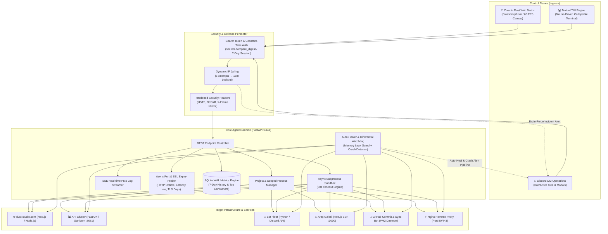

<div align="center">

# 🛡️ DustOps

### Enterprise-Grade Infrastructure Orchestrator, Scoped Process Lifecycle Manager & Unified Telemetry Matrix

[](https://python.org)
[](https://fastapi.tiangolo.com)
[](https://discordpy.readthedocs.io/)
[](https://textual.textualize.io/)
[](#-7-day-historical-telemetry--top-consumers-analytics)
[](#5-intelligent-auto-healer--ram-leak-guard)
[](LICENSE)

<br/>

> **"Eliminating process blindness, brittle shell scripts, and manual SSH intervention across mission-critical cloud nodes."**

</div>

---

## Executive Summary

**DustOps** is an asynchronous, event-driven infrastructure control, process orchestration, and telemetry analytics suite designed for production Virtual Dedicated Servers (VDS) and microservice clusters.

Modern cloud nodes and multi-tenant servers frequently suffer from unmonitored background workers, silent memory leaks, generic process collisions (such as identical `node` or `python3` binary signatures), and fragmented log monitoring. DustOps solves these architectural challenges by providing **deterministic project-scoped process mapping**, **an automated memory-leak Auto-Healer**, **Server-Sent Events (SSE) live log streaming**, **7-day SQLite WAL telemetry analytics**, and **triple-interface unified management** (Cosmic Dust Web Matrix, Discord DM Operations, and Mouse-Driven Terminal TUI).

---

## 🏛️ System Architecture



---

## ⚡ Key Architectural Capabilities

### 1. Project-Based Deterministic Process Mapping (`projects.json`)
Rather than blindly matching generic binary names (`node`, `python3`), the Core Agent maps running processes deterministically by evaluating:
- **Process Working Directory (`proc.cwd()`):** Matches exact project root hierarchies.
- **Full Execution Command Line (`proc.cmdline()`):** Matches script entrypoints and arguments.
- **Port Bindings (`proc.net_connections()`):** Matches active listening TCP sockets.

This guarantees zero cross-service collision between independent projects residing on the same host.

### 2. 📋 Real-Time Live Log Streaming (SSE & TUI)
- **Zero-SSH Live Logging:** Direct streaming of process and PM2 output via **Server-Sent Events (`GET /projects/{id}/logs/stream`)**.
- **ANSI Color Terminal Modal:** Web dashboard features a deep obsidian terminal window parsing ANSI colors (green for online, red for error, yellow for warning) with auto-scroll toggles and instant buffer clearing.
- **CLI Log Inspection:** Select any project or service in the Textual TUI and press <kbd>l</kbd> to view real-time PM2 logs without opening tmux or external terminal sessions.

### 3. 🌐 Infrastructure Port, Uptime & SSL Expiry Matrix
- **Automated Health Probing:** Concurrently checks network reachability and latency across all microservices and edge proxies.
- **TLS/SSL Expiry Countdown:** Queries remote TLS sockets on port 443 (e.g. `https://dust-studio.com`) to extract `notAfter` timestamps, calculating exact days remaining before Let's Encrypt certificate renewal.
- **Visual Status Ribbon:** Renders green/red status pills, latency in milliseconds, and SSL validity countdown badges.

### 4. 🔐 Glassmorphism 256-Bit Bearer Authentication
- **Modern Login Gateway:** Replaces default browser HTTP Basic Auth popups with a floating, frosted glass login card backed by interactive 60 FPS particle physics.
- **Cryptographic Tokens:** Issues 256-bit URL-safe Bearer tokens valid for 7-day sessions, supporting `Authorization: Bearer <token>`, cookies, or URL query parameters for EventSource SSE streams.
- **Anti-Bruteforce Defense:** Employs constant-time string comparisons (`secrets.compare_digest`), locking out attacker IPs for 900 seconds after 5 failed attempts while triggering an automated high-priority Discord alert.

### 5. 🛡️ Intelligent Auto-Healer & RAM Leak Guard
- **Continuous Memory Surveillance:** Scans tracked processes every 30 seconds for sustained memory accumulation.
- **Automated Soft Healing:** If a microservice exceeds the configured threshold (`MAX_PROCESS_MEMORY_MB = 250`) for 3 consecutive intervals (~1.5 to 2 minutes), DustOps triggers an automated soft restart (`pm2 restart <service>`) to reclaim system memory.
- **Instant Discord Incident Dispatch:** Alerts the server administrator with formatted notifications:  
  *`"🛡️ [Auto-Healer] 'dust-studio' exceeded 285MB RAM limit. Automatically soft-restarted to heal VDS memory."`*

### 6. 📈 7-Day Historical Telemetry & Top Consumers Analytics
- **SQLite WAL Storage (`data/history.db`):** Highly performant Write-Ahead Logging database taking snapshots every 5 minutes with zero CPU overhead and automatic 7-day retention (~2 MB disk footprint).
- **Interactive Dual-Line SVG Trends:** Visualizes CPU load % and RAM utilization % over 24-Hour, 3-Day, and 7-Day windows with custom hover tooltips.
- **Ranked Top Consumers Table:** Aggregates peak RAM, average RAM, peak CPU, and occurrence rates to identify which processes consumed the most host resources over the selected timeframe.

### 7. Sandboxed Asynchronous Command Execution
- **Non-Blocking Architecture:** Executed via `asyncio.create_subprocess_shell`. Long-running tasks (e.g. `git pull && npm run build`) never block the FastAPI event loop, ensuring continuous heartbeat tracking and telemetry streaming.
- **Strict 30-Second Timeout Shield:** Commands exceeding 30 seconds are automatically terminated via `SIGKILL` to prevent resource hogging.
- **Directory Scoping:** Commands execute strictly inside the configured project root (`cwd`).

---

## 🖥️ Triple-Interface Unified Control Matrix

### 🌌 1. Cosmic Dust Web Matrix
- **Visual Design:** High-performance HTML5 Canvas particle engine rendering 1,300+ cosmic dust particles with interactive mouse-vortex and spring physics.
- **Aesthetic:** Minimalist Zinc-950 (`#09090b`) dark luxury palette, translucent glassmorphism cards (`backdrop-filter: blur(20px)`), and Google `Inter` + `JetBrains Mono` typography.
- **Functionality:** Real-time CPU, RAM, Disk gauges, live port/SSL health matrix, 7-day historical chart, live PM2 log streaming modal, and sandboxed shell command runner.

### 🤖 2. Discord DM Incident & Control Center
- **Owner-Only Security:** All button callbacks, modals, and selects enforce `interaction.user.id == OWNER_USER_ID`.
- **Grouped Hierarchical Embeds:** Displays clean ASCII tree structures showing service states, PIDs, ports, CPU, and RAM metrics.
- **Interactive Modals & Menus:** Dropdown project restart selector, interactive process termination modal, and directory-scoped command execution dialogs.

<div align="center">
  
  <p><em>Real-Time Project Scoped Management & Interactive Action Components inside Discord Direct Messages</em></p>
</div>

### 💻 3. Modern Terminal TUI (`Textual` Engine)
- **Invocation:** Accessible directly from any terminal via the `dustops` command or `python3 cli/menu.py`.
- **Features:** Mouse-supported collapsible tree view, live resource progress bars, real-time log inspector, and keybindings:
  - <kbd>r</kbd> — Instant project / service restart
  - <kbd>c</kbd> — Interactive shell command popup
  - <kbd>l</kbd> — Live PM2 log & service telemetry inspector
  - <kbd>u</kbd> — Manual data synchronization
  - <kbd>q</kbd> — Clean exit

<div align="center">
  
  <p><em>Mouse-Supported Collapsible Project Tree & Live Telemetry Gauges inside the Linux Terminal</em></p>
</div>

---

## 📡 REST API Specification

All authenticated endpoints accept `Authorization: Bearer <token>`, session cookies, or legacy HTTP Basic Auth.

| Method | Endpoint | Description | Response |
| :---: | :--- | :--- | :---: |
| `GET` | `/` | Serves the Cosmic Dust Web Matrix | `HTML` |
| `GET` | `/health` | Unauthenticated agent liveness probe | `{"status": "ok"}` |
| `POST` | `/auth/login` | Authenticate and obtain 7-day Bearer token | `LoginResponse` |
| `POST` | `/auth/logout` | Revoke active session token | `{"success": true}` |
| `GET` | `/metrics` | CPU, RAM, and Disk storage snapshot | `SystemMetrics` |
| `GET` | `/metrics/history?range={24h\|3d\|7d}` | Historical time-series telemetry | `{"range": "...", "data": [...]}` |
| `GET` | `/metrics/top-consumers?range={24h\|3d\|7d}` | Ranked list of top resource-consuming processes | `{"consumers": [...]}` |
| `GET` | `/health/matrix` | Real-time port reachability, ping latency & SSL expiry | `{"services": [...]}` |
| `GET` | `/projects` | Live project clusters with nested process info | `list[ProjectStatus]` |
| `GET` | `/projects/{id}` | Telemetry for a single project cluster | `ProjectStatus` |
| `POST` | `/projects/{id}/restart` | Triggers configured project restart pipeline | `ActionResult` |
| `POST` | `/projects/{id}/exec` | Executes sandboxed shell command inside project `cwd` | `ExecResult` |
| `GET` | `/projects/{id}/logs` | Returns recent static logs (last 80 lines) | `{"logs": "..."}` |
| `GET` | `/projects/{id}/logs/stream` | **Server-Sent Events (SSE)** real-time log stream | `text/event-stream` |
| `POST` | `/kill/{pid}` | Sends `SIGTERM` / `SIGKILL` to target process | `ActionResult` |
| `GET` | `/crashes` | Drains pending crash & auto-heal events from memory buffer | `list[CrashEvent]` |

---

## 📋 Configuration Reference

### `.env` Specification

| Variable | Type | Default | Description |
| :--- | :---: | :---: | :--- |
| `DISCORD_TOKEN` | `string` | — | Discord Bot token from Developer Portal |
| `OWNER_USER_ID` | `int` | — | Discord user ID authorized for DM control |
| `API_HOST` | `string` | `0.0.0.0` | Bind IP for Core Agent REST API |
| `API_PORT` | `int` | `4141` | Bind port for Core Agent REST API |
| `WEB_USERNAME` | `string` | `dust.exe` | Authentication username for Web and API |
| `WEB_PASSWORD` | `string` | — | Authentication password for Web and API |
| `MAX_PROCESS_MEMORY_MB` | `float` | `250.0` | RAM threshold for automated Auto-Healer soft restart |
| `WATCH_KEYWORDS` | `list` | `node,python` | Fallback process keywords for watchdog |
| `WATCH_PORTS` | `list` | `3000,8080,4141`| Port bindings to continuously track |
| `WATCHDOG_INTERVAL` | `int` | `5` | Background differential check interval (sec) |
| `DASHBOARD_INTERVAL` | `int` | `3600` | Automated Discord DM embed update interval |

### `projects.json` Schema Example

```json
{
  "projects": [
    {
      "id": "dust-studio",
      "name": "🌐 dust-studio.com",
      "cwd": "/root/dust-studio",
      "services": [
        {
          "name": "Main Bot",
          "match": "dust-studio",
          "port": 3050,
          "restart_cmd": "pm2 restart dust-studio"
        }
      ]
    },
    {
      "id": "github-commit-bot",
      "name": "🐙 GitHub Commit & Sync Bot",
      "cwd": "/root/telemetry-sync-data",
      "services": [
        {
          "name": "Sync Daemon",
          "match": "github-commit-bot",
          "port": null,
          "restart_cmd": "pm2 restart github-commit-bot"
        }
      ]
    },
    {
      "id": "dust-studio-site",
      "name": "⚡ Dust Studio Nginx Web",
      "cwd": "/root/dust-studio-site",
      "services": [
        {
          "name": "Nginx Web Server",
          "match": "nginx",
          "port": 80,
          "restart_cmd": "systemctl reload nginx"
        }
      ]
    }
  ]
}
```

---

## 🚀 Quick Start Guide

### 1. Clone & Setup Environment
```bash
git clone https://github.com/Dust-exe/DustOps.git
cd DustOps

# Create virtual environment (recommended)
python3 -m venv .venv
source .venv/bin/activate

# Install production dependencies
pip install -r requirements.txt
```

### 2. Configure Credentials & Projects
```bash
cp .env.example .env
nano .env

cp projects.example.json projects.json
nano projects.json
```

### 3. Production Deployment (via PM2)
```bash
# Start Core Agent Daemon
pm2 start run_agent.py --name dustops-agent --interpreter python3

# Start Discord Bot Controller
pm2 start run_bot.py --name dustops-bot --interpreter python3

# Save PM2 state for automatic reboot recovery
pm2 save
```

### 4. Access Control Matrix
- **Web Interface:** Navigate to `http://<SERVER_IP>:4141` in any browser.
- **Terminal TUI:** Run `python3 cli/menu.py` or install globally via `ln -s $(pwd)/cli/menu.py /usr/local/bin/dustops`.
- **Discord:** Check your direct messages with the configured bot.

---

## 🛡️ License

Distributed under the **MIT License**. See [`LICENSE`](LICENSE) for complete terms.

---

<div align="center">

**Crafted with precision by [dust.exe](https://dust-studio.com) • System Architect & Full-Stack Engineer**

*Built for resilience. Engineered for production.*

</div>
